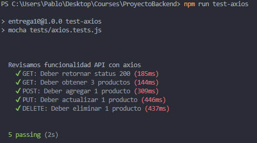
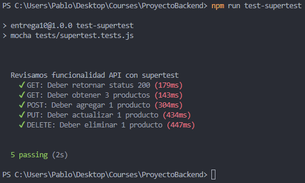

# TESTEAMOS NUESTRA API REST (desafio 21) 
### Consignas
Revisar en forma completa el proyecto entregable que venimos realizando, refactorizando y reformando todo lo necesario para llegar al esquema de servidor API RESTful en capas planteado en esta clase.

Asegurarse de dejar al servidor bien estructurado con su ruteo / controlador, negocio, validaciones, persistencia y configuraciones (preferentemente utilizando en la codificación clases de ECMAScript).

No hace falta realizar un cliente ya que utilizaremos tests para verificar el correcto funcionamiento de las funcionalidades desarrolladas.

- Desarrollar un cliente HTTP de pruebas que utilice Axios para enviar peticiones, y realizar un test de la funcionalidad hacia la API Rest de productos, verificando la correcta lectura de productos disponibles, incorporación de nuevos productos, modificación y borrado.
- Realizar el cliente en un módulo independiente y desde un código aparte generar las peticiones correspondientes, revisando los resultados desde la base de datos y en la respuesta del servidor obtenida en el cliente HTTP.
- Luego, realizar las mismas pruebas, a través de un código de test apropiado, que utilice mocha, chai y Supertest, para probar cada uno de los métodos HTTP de la API Rest de productos.
- Escribir una suite de test para verificar si las respuestas a la lectura, incorporación, modificación y borrado de productos son las apropiadas. Generar un reporte con los resultados obtenidos de la salida del test.

#### Solución

Creamos la carpeta /tests con las pruebas, además de unos comando para npm

```c
    "test-axios": "mocha tests/axios.tests.js",
    "test-supertest": "mocha tests/supertest.tests.js"
```

Resultados:




# MEJORAR LA ARQUITECTURA DE NUESTRA API (desafio 20) 
### Consignas 
- Modificar la capa de persistencia incorporando los conceptos de Factory, DAO, y DTO.
- Los DAOs deben presentar la misma interfaz hacia la lógica de negocio de nuestro servidor.
- El DAO seleccionado (por un parámetro en línea de comandos como lo hicimos anteriormente) será devuelto por una Factory para que la capa de negocio opere con el.
- Cada uno de estos casos de persistencia, deberán ser implementados usando el patrón singleton que impida crear nuevas instancias de estos mecanismos de acceso a los datos.
- Comprobar que si llamo a la factory dos veces, con una misma opción elegida, devuelva la misma instancia.
- Implementar el patrón Repository para la persistencia de productos y mensajes.


# DIVIDIR EN CAPAS NUESTRO PROYECTO (desafio 19)

### Consigna 
Dividir en capas el proyecto entregable con el que venimos trabajando (entregable clase 16: loggers y profilers), agrupando apropiadamente las capas de ruteo, controlador, lógica de negocio y persistencia.

Considerar agrupar las rutas por funcionalidad, con sus controladores, lógica de negocio con los casos de uso, y capa de persistencia.

La capa de persistencia contendrá los métodos necesarios para atender la interacción de la lógica de negocio con los propios datos.

# TERCERA ENTREGA DEL PROYECTO FINAL (desafio 18)
## Deberás entregar el avance de tu aplicación eCommerce Backend correspondiente a la tercera entrega de tu proyecto final.

### Se debe entregar:
Un menú de registro y autenticación de usuarios basado en passport local, guardando en la base de datos las credenciales y el resto de los datos ingresados al momento del registro.

- El registro de usuario consiste en crear una cuenta en el servidor almacenada en la base de datos, que contenga el email y password de usuario, además de su nombre, dirección, edad, número de teléfono (debe contener todos los prefijos internacionales) y foto ó avatar. La contraseña se almacenará encriptada en la base de datos.

- La imagen se podrá subir al servidor y se guardará en una carpeta pública del mismo a la cual se tenga acceso por url.

Un formulario post de registro y uno de login. De modo que, luego de concretarse cualquiera de estas operaciones en forma exitosa, el usuario accederá a su home.

- El usuario se logueará al sistema con email y password y tendrá acceso a un menú en su vista, a modo de barra de navegación. Esto le permitirá ver los productos totales con los filtros que se hayan implementado y su propio carrito de compras e información propia (datos de registro con la foto). Además, dispondrá de una opción para desloguearse del sistema.

- Ante la incorporación de un usuario, el servidor enviará un email al administrador con todos los datos de registro y asunto 'nuevo registro', a una dirección que se encuentre por el momento almacenada en una constante global.

Envío de un email y un mensaje de whatsapp al administrador desde el servidor, a un número de contacto almacenado en una constante global.

- El usuario iniciará la acción de pedido en la vista del carrito.

- Será enviado una vez finalizada la elección para la realizar la compra de productos.

- El email contendrá en su cuerpo la lista completa de productos a comprar y en el asunto la frase 'nuevo pedido de ' y el nombre y email del usuario que los solicitó. En el mensaje de whatsapp se debe enviar la misma información del asunto del email.

- El usuario recibirá un mensaje de texto al número que haya registrado, indicando que su pedido ha sido recibido y se encuentra en proceso.

### Aspectos a incluir en el entregable:
- El servidor trabajará con una base de datos DBaaS (Ej. MongoDB Atlas) y estará preparado para trabajar en forma local o en la nube a través de la plataforma PaaS Heroku.
- Habilitar el modo cluster para el servidor, como opcional a través de una constante global.
- Utilizar alguno de los loggers ya vistos y así reemplazar todos los mensajes a consola por logs eficientes hacia la misma consola. En el caso de errores moderados ó graves el log tendrá además como destino un archivo elegido.
- Realizar una prueba de performance en modo local, con y sin cluster, utilizando Artillery en el endpoint del listado de productos (con el usuario vez logueado). Verificar los resultados.


### Notas:
Para iniciar el proyecto en modo cluster se usa:
```c
nodemon index.js -m CLUSTER
```

Alternativamente, se usa una variable en un archivo .env llamada USE_CLUSTER=1

Las pruebas de artillery se encuentran en la carpeta raíz, se utilizó el siguiente comando para generarlas:
```c
artillery quick -c 20 -n 20 "http://localhost:8080/productos" > artillery_FORK.txt
artillery quick -c 20 -n 20 "http://localhost:8080/productos" > artillery_CLUSTER.txt
```

Hay una variable en el modelo de los usuarios llamada **is_admin**, de ser valor "true" se acceden a rutas de administrador y nuevas opciones.

Por default se conecta a una base de datos llamada "ecommerce" en **'mongodb://127.0.0.1:27017/ecommerce**
Para cambiar esta conexión se requiere crear un archivo .env en el root del proyecto y agregar una variable llamada **MONGO_URI**
Se puede cambiar el puerto para el servidor express agregando una variable con nombre **PORT**

En caso de requerir firebase se requieren las siguientes variables en el archivo .env :

- PORT= *por default 8080*
- MONGO_UR= *por default mongodb://127.0.0.1:27017/ecommerce* 
- USE_CLUSTER= *por default 0* 
- ADMIN_EMAIL= *cuenta de gmail que mandará el correo* 
- ADMIN_EMAIL_PASS= *pass de la app de gmail* 
- NOTIFICATIONS_EMAIL= *cuenta de correo donde llegarán los mensajes, puede ser la misma que ADMIN_EMAIL*
- IGNORE_TWILIO= *Agregar para ignora crear mensajes de SMS y whatsapp*
- TWILIO_ID=
- TWILIO_TOKEN=
- TWILIO_FROM_NUMBER=
- TWILIO_TO_NUMBER=
- TWILIO_WHATSAPP_FROM_NUMBER= *en formato  whatsapp:+XXXXXXXXXX*
- TWILIO_WHATSAPP_TO_NUMBER= *en formato  whatsapp:+XXXXXXXXXX*

## Rutas principales:
La tercera entrega contiene una interfaz con handlebars. Por default, las rutas de acceso son las siguientes:

| Ruta         | Función     |
|--------------|-----------|
| http://localhost:8080| Login de usuario|
| http://localhost:8080/signup| Signup de usuario|
| http://localhost:8080/productos| Listado de productos, un administrador puede modificar el inventario de productos|
| http://localhost:8080/carrito| Los productos agregados al carrito|
| http://localhost:8080/ordenes| Las ordenes generadas por el usuario|
| http://localhost:8080/ordenes/admin| Las ordenes generadas por todos los usuarios, únicamente para usuarios administradores|

## Rutas API:
El router base '/api/productos' implementa cuatro funcionalidades:
- GET: '/:id?' - Me permite listar todos los productos disponibles ó un producto por su id
- POST: '/' - Para incorporar productos al listado
- PUT: '/:id' - Actualiza un producto por su id
- DELETE: '/:id' - Borra un producto por su id

