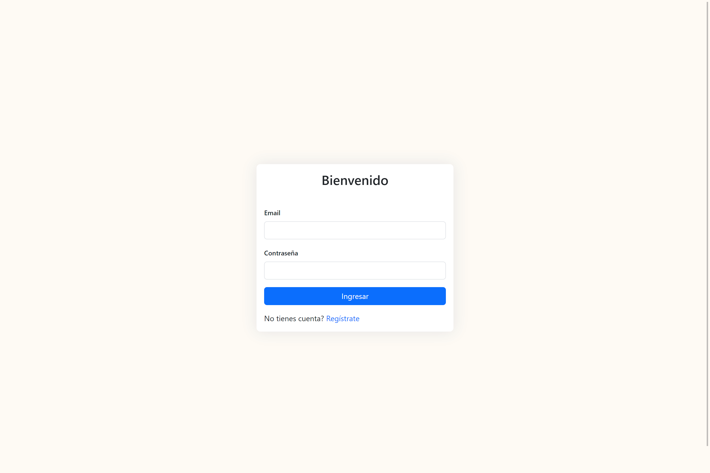
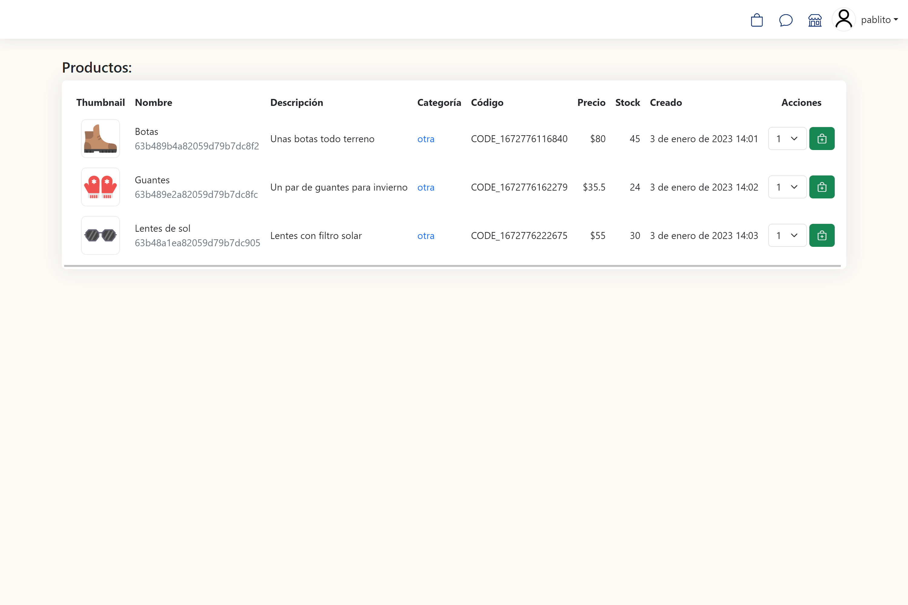
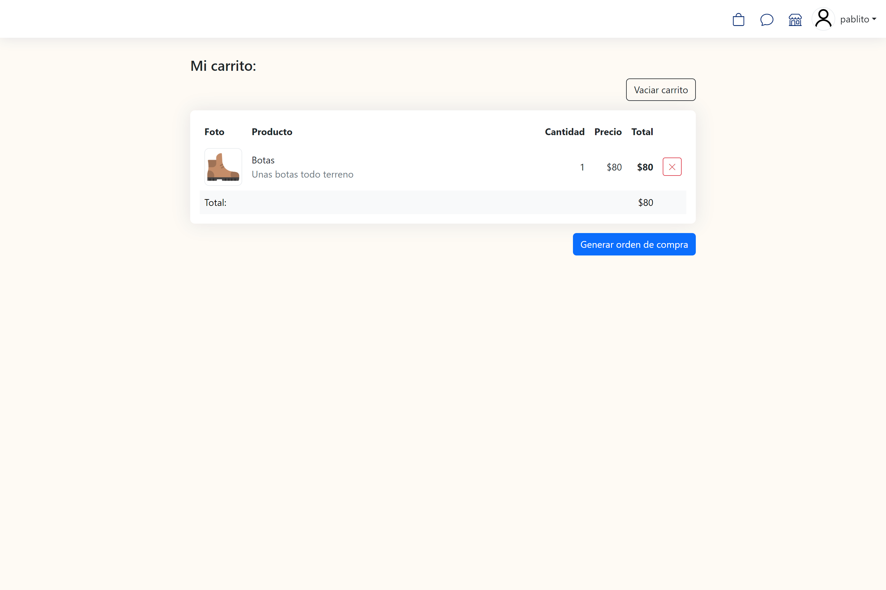
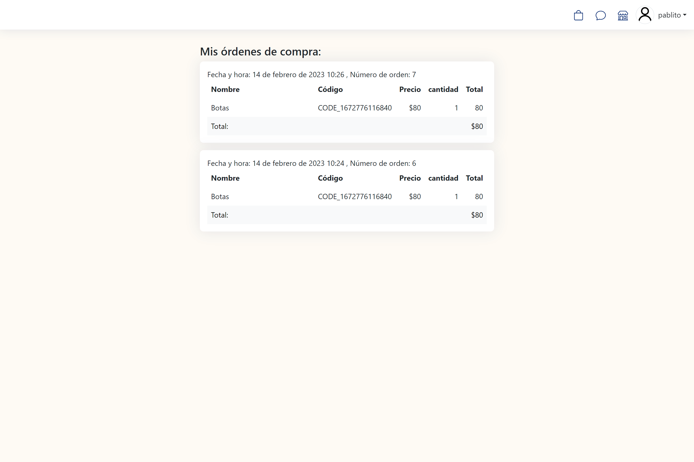
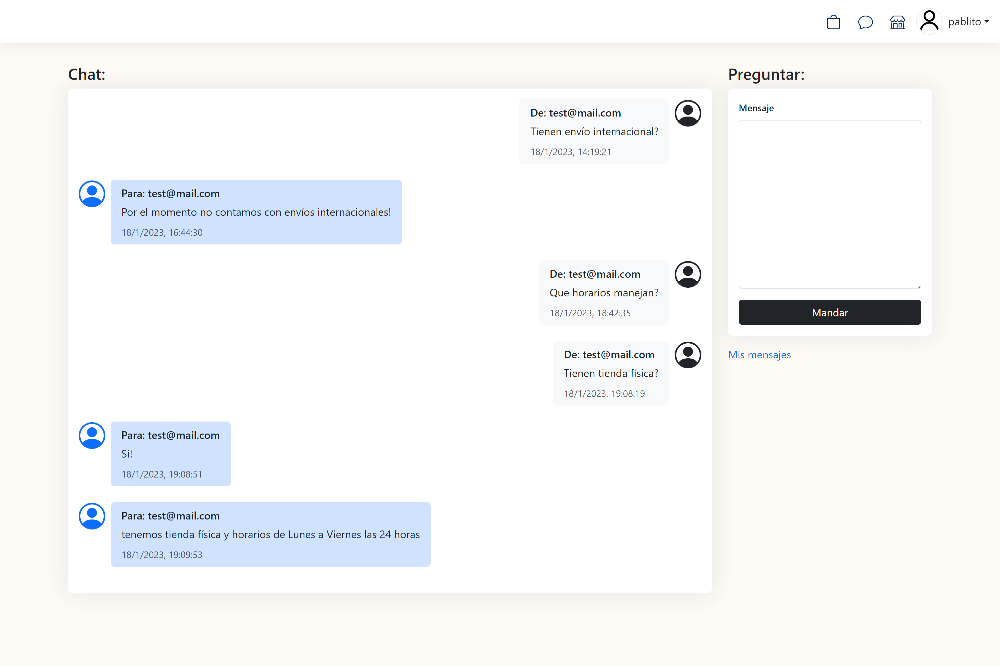

# Curso Backend - MERN Stack: Proyecto Final E-commerce project

[Documento](https://docs.google.com/document/d/1PlSZ5XX-a4dhHV13ER4DVphFo_IAcTfCCsziRH4Xs7M/edit) con requerimientos 

## Preview

Login:




Productos:




Carrito:




Ordenes:




Chat:



## Rutas principales:
El proyecto cuanta con una interfaz con handlebars. Las rutas principales son:

| Ruta         | Función     |
|--------------|-----------|
| http://localhost:8080| Login de usuario|
| http://localhost:8080/signup| Signup de usuario|
| http://localhost:8080/prifile| Información del usuario|
| http://localhost:8080/productos/:id?| Listado de productos, un administrador puede modificar el inventario de productos|
| http://localhost:8080/carrito| Los productos agregados al carrito|
| http://localhost:8080/ordenes| Las ordenes generadas por el usuario|
| http://localhost:8080/ordenes/admin| Las ordenes generadas por todos los usuarios, únicamente para usuarios administradores|
| http://localhost:8080/chat| Mensajes tipo chat |
| http://localhost:8080/extra/info| Configuración del servidor|

## Rutas API:
El proyecto cuenta con una API para realizar casi toda la funcionalidad que realiza la web. La funcionalidad excluida es: signup, chat y configuración del servidor.

| Método         | Ruta         | Permisos     | Parámetros (body) | Parámetros (query) | Función     |
|--------------|--------------|-----------|-----------|-----------|-----------|
|POST| http://localhost:8080/api/login| Cualquier usuario | email, password | - |Login de usuario require parámetros email y password|
|GET| http://localhost:8080/api/profile| Usuarios registrados | - | - | Información del usuario|
|GET| http://localhost:8080/api/productos/:id?| Usuarios logeados | - | id (opcional) | Listado de productos o un producto con ID|
|POST| http://localhost:8080/api/productos/| Admins | title, description, price, thumbnail, stock, category | - |Agregamos productos al catálogo|
|PUT| http://localhost:8080/api/productos/| Admins | id, title, description, price, thumbnail, stock, category | - | Modificamos un producto del catálogo|
|DELETE| http://localhost:8080/api/productos/| Admins | id | - | Eliminamos un producto del catálogo|
|GET| http://localhost:8080/api/productos/categoria/:category| Usuarios registrados | - | category | Productos de la categoria|
|GET| http://localhost:8080/api/carrito| Usuarios registrados | - | - | Los productos agregados al carrito|
|POST| http://localhost:8080/api/carrito/addProduct| Usuarios registrados | pid, quantity | - | Agregamos productos al carrito, pid = id del producto a agregar|
|POST| http://localhost:8080/api/carrito/removeProduct| Usuarios registrados | pid | - | Removemos productos al carrito, pid = id del producto a agregar|
|POST| http://localhost:8080/api/carrito/cleanCart| Usuarios registrados | - | - | Removemos todos los productos del carrito|
|GET| http://localhost:8080/api/ordenes| Usuariogs logeados | - | - |Las ordenes generadas por el usuario|
|POST| http://localhost:8080/api/ordenes/make| Usuariogs logeados | - | - |Genera una nueva orden con los productos del carrito|
|GET| http://localhost:8080/api/ordenes/admin| Admins | - | - | Las ordenes generadas por todos los usuarios|

### Login en API:

Primero hacemos un POST a la ruta *http://localhost:8080/api/login*

Los valores del body en el request son:
| Nombre | Valor |
| email | *el email del usuario a logear*|
| password | *la constraseña del usuario*|

La respuesta debe verse con el siguiente formato:

```c
 "token": "la cadena del token"
```

A partir de ahí, **agregar el valor del token obtenido como parámetro query llamado secret_token**

| Nombre | Valor |
| secret_token | *el valor obtenido en el paso anterior*|

### Notas:
Para iniciar el proyecto en modo cluster se usa:
```c
nodemon index.js -m CLUSTER
```

Alternativamente, se usa una variable en un archivo .env llamada USE_CLUSTER=1

Hay una variable en el modelo de los usuarios llamada **is_admin**, de ser valor "true" se acceden a rutas de administrador y nuevas opciones.

Por default se conecta a una base de datos llamada "ecommerce" en **'mongodb://127.0.0.1:27017/ecommerce**
Para cambiar esta conexión se requiere crear un archivo .env en el root del proyecto y agregar una variable llamada **MONGO_URI**
Se puede cambiar el puerto para el servidor express agregando una variable con nombre **PORT**

En caso de requerir firebase se requieren las siguientes variables en el archivo .env :

- PORT= *por default 8080*
- SESSION_LIMIT= *duración de sesión en milisegundos, por default 900000*
- MONGO_URI= *por default mongodb://127.0.0.1:27017/ecommerce* 
- USE_CLUSTER= *por default 0* 
- IGNORE_EMAIL= *omite el envio de correos* 
- ADMIN_EMAIL= *cuenta de gmail que mandará el correo* 
- ADMIN_EMAIL_PASS= *pass de la app de gmail* 
- NOTIFICATIONS_EMAIL= *cuenta de correo donde llegarán los mensajes, puede ser la misma que ADMIN_EMAIL*
- IGNORE_TWILIO= *Agregar para ignora crear mensajes de SMS y whatsapp*
- TWILIO_ID=
- TWILIO_TOKEN=
- TWILIO_FROM_NUMBER=
- TWILIO_TO_NUMBER=
- TWILIO_WHATSAPP_FROM_NUMBER= *en formato  whatsapp:+XXXXXXXXXX*
- TWILIO_WHATSAPP_TO_NUMBER= *en formato  whatsapp:+XXXXXXXXXX*